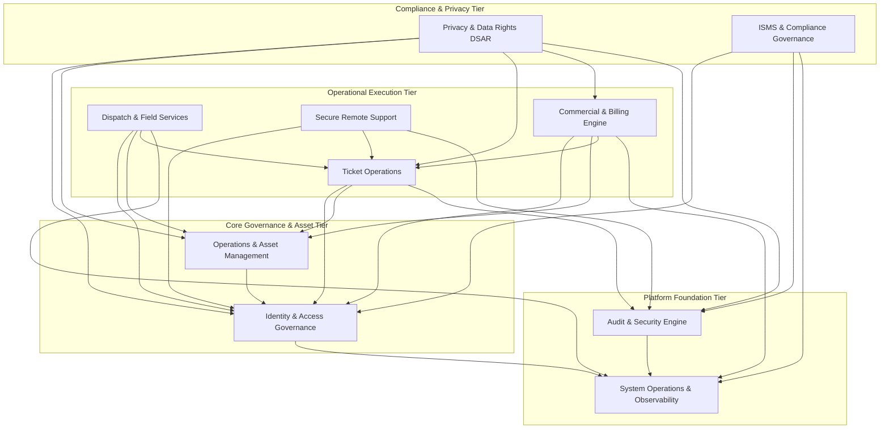

# MASTER-ARCHITECTURE-ANALYSIS — First-Principles System Architecture

**Document Target:** `docs/MASTER-ARCHITECTURE-ANALYSIS.md`  
**Authoritative Sources:**
- [`docs/MASTER-SPEC-001-002.md`](file:///c:/SURAJ/Remotfix/docs/MASTER-SPEC-001-002.md) (Locked Master Baseline)
- [`docs/MASTER-BASELINE-AUDIT.md`](file:///c:/SURAJ/Remotfix/docs/MASTER-BASELINE-AUDIT.md) (Approved Baseline Audit)
- [`docs/MASTER-BASELINE-VERIFICATION.md`](file:///c:/SURAJ/Remotfix/docs/MASTER-BASELINE-VERIFICATION.md) (Second-Pass Verification)

**Scope & Nature:** First-principles architectural decomposition and boundary analysis derived strictly from the Master specification.  
**Strict Directives:**
- All legacy M1–M29 architectures, modules, and entity numbers are completely discarded.
- No application code, database migrations, Prisma schemas, or dependencies are introduced.
- Master documents remain 100% read-only.
- All ambiguous items are carried forward unresolved.

---

## 1. Architecture Principles

The Master specification establishes twelve binding architectural principles that govern the design, boundary formulation, and technical evolution of the platform:

1. **Modular Monolith by Design:**
   The MVP is engineered as a cohesive, modular monolith within a single deployable unit. This topology eliminates premature distributed-systems overhead (e.g., network latency, partial failures, distributed transactions, service-mesh complexity), while strictly enforcing internal domain boundaries to enable future microservice decomposition if business scale warrants it. *(Sources: Master Section 1.1, 2.1, 2.17, Lines 1756–1761)*

2. **Capital Efficiency & Zero/Minimal Cost Baseline:**
   The initial operational footprint must run on near-zero or low-cost infrastructure tiers without paid enterprise commitments. The architecture is explicitly structured so that financial constraints do not force subsequent architectural redesigns or code rewrites when moving to enterprise-grade infrastructure. *(Sources: Master Section 1.1, 1.3, 2.2, Lines 1756–1761)*

3. **Strict Provider Independence via Abstraction:**
   Business domain logic must never bind directly to third-party vendor APIs, SDKs, or cloud-specific proprietary services. All external I/O must terminate at explicit provider interfaces (`StorageProvider`, `EmailProvider`, `NotificationProvider`, `PaymentProvider`, `RemoteSupportProvider`, `MapsProvider`), enabling zero-downtime adapter swaps. *(Sources: Master Section 1.1, 1.7, 2.2)*

4. **Multi-Tenant Isolation by Construction:**
   Multi-tenancy is enforced at the data layer through mandatory `organization_id` scoping on every tenant-owned record and query. Cross-tenant leakage is treated as a critical security vulnerability and prevented by database constraints, application-tier tenancy context guards, and automated cross-tenant failure test suites. *(Sources: Master Section 1.7, 2.8, 5.12)*

5. **Security and Privacy by Design:**
   Defense-in-depth is implemented across all tiers. Privileged accounts require Multi-Factor Authentication (MFA). All remote-support sessions mandate explicit customer authorization and consent with strict zero-credential storage. Data is encrypted in transit (TLS) and at rest (AES-256). Secrets are externalized from code and masked in logs. Passwords use irreversible cryptographic hashing (Argon2id/bcrypt is a CANDIDATE ENGINEERING OPTION — NOT LOCKED BY MASTER; Master mandates irreversible cryptographic hashing without locking a specific algorithm). *(Sources: Master Section 1.1, 1.3, 2.7, 2.9, 2.10, 2.11)*

6. **Environment Separation & Data Sanitization:**
   A strict 5-tier environment progression model (`LOCAL` → `DEV` → `STAGING` → `PROD` → `RECOVERY`) governs delivery. Production data must never be imported into lower environments without certified, irreversible anonymization. *(Sources: Master Section 1.7, 2.4, 2.10)*

7. **Prohibition of Blind Data Deletion:**
   Data Subject Access Requests (DSAR) and privacy erasure workflows must never bypass statutory, commercial, taxation, or security retention requirements. Legally mandated retention overrides individual deletion requests through configurable retention policies. *(Sources: Master Section 1.7, 2.12, 3.8, 5.10)*

8. **ISO Certification Alignment Without Premature Claims:**
   The architecture rigorously aligns with ISO/IEC 27001:2022 (ISMS) and ISO/IEC 27701:2025 (PIMS) control structures, maintaining complete 7-stage traceability (`Risk` → `Requirement` → `Architecture` → `Implementation` → `Test` → `Evidence` → `Review`). The organization is explicitly prohibited from claiming certified status prior to independent accredited audit. *(Sources: Master Preamble, Section 1.7, 2.13)*

9. **Single Authoritative Datastore:**
   PostgreSQL is the single authoritative source of truth for all transactional business, security, and governance data. Secondary datastores (e.g., Redis) are strictly reserved for transient cache, session coordination, and background queues. *(Sources: Master Section 2.2, 2.5)*

10. **Asynchronous Processing for Heavy Workloads:**
    Heavy reporting, bulk exports, SLA background monitoring, retention enforcement, and notifications must never block the synchronous HTTP request/response cycle. Asynchronous execution via dedicated queue workers is mandatory to preserve the p95 ≤ 500ms API latency budget. *(Sources: Master Section 2.17)*

11. **Verified Backup Integrity:**
    Backups are architecturally and operationally invalid until restoration has been automatically executed, validated against integrity checks, and recorded in compliance evidence registers. RPO and RTO are targeted at ≤ 24 hours. *(Sources: Master Section 1.8, 2.16, 3.10)*

12. **Inverted Layered Dependency Direction:**
    The backend architecture follows strict inward dependency rules: `Controller` → `Application Service` → `Domain Rules` → `Repository Interface` → `Infrastructure Adapter` → `PostgreSQL / External Provider`. Business logic is completely decoupled from infrastructure drivers. *(Sources: Master Section 2.3)*

---

## 2. Capability Map

Rather than creating a 1:1 mapping of requirements to modules, the Master's functional and operational specifications are synthesized into nine coherent business and operational capabilities:

```
+----------------------------------------------------------------------------------------------------+
|                                      REMOTFIX CAPABILITY MAP                                       |
+------------------------------------+----------------------------------+----------------------------+
| 1. Identity & Access Governance    | 2. Operations & Asset Management | 3. Ticket Operations       |
|    - User Authentication & Sessions|    - Customer & Contact Records  |    - Ticket Intake & Triage|
|    - MFA Verification              |    - Service Locations           |    - SLA Tracking & Clocks |
|    - Tenant Context Resolution     |    - Asset Inventory             |    - Internal Messaging    |
|    - RBAC & Permission Enforcement |    - Service Catalog             |    - File Attachments      |
+------------------------------------+----------------------------------+----------------------------+
| 4. Dispatch & Field Services       | 5. Commercial & Billing Engine   | 6. Secure Remote Support   |
|    - Technician Profiles & Skills  |    - Customer Contracts & Terms  |    - Session Coordination  |
|    - Job Creation & Scheduling     |    - Service Entitlements        |    - Explicit Consent Flow |
|    - Dispatch Candidate Matching   |    - Consumption Usage Tracking  |    - Dual Authorization    |
|    - Appointment & Check-in/out    |    - Quotes & Invoices (Dodo)    |    - Zero-Credential Access|
+------------------------------------+----------------------------------+----------------------------+
| 7. Privacy & Data Rights (DSAR)    | 8. ISMS & Compliance Governance  | 9. System & Observability  |
|    - Subject Access/Erasure Intake |    - Control & Risk Registers    |    - Health Probes (Live/Ready)|
|    - Retention Rules Engine        |    - Security Policy Versions    |    - Telemetry (Logs/Traces)  |
|    - Consent Lifecycle             |    - Vendor & Asset Registers    |    - Background Queue/Worker  |
|    - Data Export & Anonymization   |    - Incident Records & Evidence |    - Security Audit Logging   |
+------------------------------------+----------------------------------+----------------------------+
```

### Capability Definitions:

1. **Identity & Access Governance:**
   Authenticates users, manages user accounts, handles MFA challenges, resolves multi-tenant organization context, and evaluates role-based permission sets across all protected endpoints.
   *(Master 1.2, 1.3, 2.7, 5.1, 5.2)*

2. **Operations & Asset Management:**
   Maintains baseline operational entities including customer organizations, primary and site contacts, physical service locations, registered customer assets (hardware/equipment), and the billable service catalog.
   *(Master 1.3, 5.3)*

3. **Ticket Operations:**
   Governs customer and staff issue intake, priority setting, SLA clock management, status transitions, collaborative messaging, and file attachments.
   *(Master 1.3, 3.3, 5.4)*

4. **Dispatch & Field Services:**
   Manages technician profiles, skill matrices, job scheduling, geographical candidate matching, calendar appointments, and field check-in/check-out execution.
   *(Master 1.3, 3.4, 5.5)*

5. **Commercial & Billing Engine:**
   Administers customer contracts, service entitlements, entitlement draw-down/usage tracking, quote generation, invoice issuance, and payment provider integration.
   *(Master 1.3, 3.6, 5.6)*

6. **Secure Remote Support:**
   Manages time-bounded remote assistance sessions, facilitating customer consent capture, technician dual-authorization, signaling connection handshakes, strict zero-credential persistence, and dedicated session audit logging.
   *(Master 1.3, 2.11, 3.7, 4.8, 5.7)*

7. **Privacy & Data Rights (DSAR):**
   Handles Data Subject Access Requests (DSARs), identity verification of requesters, retention rule evaluation, automated export compilation, and legally compliant deletion or anonymization.
   *(Master 1.3, 2.12, 3.8, 5.9, 5.10)*

8. **ISMS & Compliance Governance:**
   Maintains living registers for ISO/IEC 27001/27701 readiness: policies, versioning, employee/customer acceptances, risk register, physical/logical asset register, control register (Statement of Applicability), vendor assessments, security incident logs, and compliance evidence.
   *(Master 1.3, 2.12, 2.13, 3.9, 5.8, 5.9)*

9. **System Operations & Observability (Cross-Cutting Platform):**
   Provides foundational runtime services: immutable security audit event ingestion, system metrics, health probes, structured logging, centralized queue orchestration, rate limiting, and standard error handling.
   *(Master 2.2, 2.6, 2.14, 2.15, 2.16, 2.17, 5.8, 5.11)*

---

## 3. Domain Boundary Analysis

This section analyzes each of the nine capabilities to define its operational scope, data boundaries, and systemic responsibilities.

### 3.1 Domain: Identity & Access Governance
- **Purpose:** Provide secure identity verification, session lifecycle management, and organization-scoped authorization.
- **Responsibilities:** User registration, password authentication (Argon2id/bcrypt), MFA verification, session token issuance/refresh, organization creation, user-to-organization membership binding, role assignment, and granular permission checking (`PermissionGuard`).
- **Dependencies:** Platform Foundation (database, security events).
- **Data Owned:** `users`, `organizations`, `memberships`, `roles`, `permissions`, `role_permissions`.
- **Data Referenced:** `audit_events` (writes audit records for logins, membership changes).
- **Security Boundary:** First line of defense. Enforces tenant identification (`organization_id`) and rejects unauthenticated or unauthorized traffic before it reaches downstream domains.
- **Privacy Implications:** Holds sensitive Personal Identifiable Information (PII) including emails, password hashes, and MFA secrets. Governed by strict encryption at rest and redaction in logs.

### 3.2 Domain: Operations & Asset Management
- **Purpose:** Model the core business entities and operational assets of the service ecosystem.
- **Responsibilities:** Management of customer profiles, contacts, service locations, registered assets, and the catalog of services offered by the service provider.
- **Dependencies:** Identity & Access Governance (for tenant context and ownership).
- **Data Owned:** `organization_locations`, `contacts`, `assets`, `services`.
- **Data Referenced:** `organizations` (tenant boundary), `users` (contact/user association).
- **Security Boundary:** All records are strictly scoped by `organization_id`. Contact details and physical locations are restricted to authorized operational personnel.
- **Privacy Implications:** Contains personal contact details (names, emails, physical addresses, phone numbers) which fall under GDPR/privacy governance and DSAR export/erasure scopes.

### 3.3 Domain: Ticket Operations
- **Purpose:** Orchestrate the intake, triage, collaboration, and resolution lifecycle of customer support requests.
- **Responsibilities:** Ticket creation, assignment to technicians, status progression, priority calculation, SLA tracking, message thread management, and attachment handling.
- **Dependencies:** Identity & Access Governance, Operations & Asset Management (locations, assets, contacts), Platform Foundation (storage provider, notifications).
- **Data Owned:** `tickets`, `ticket_messages`, `ticket_attachments`.
- **Data Referenced:** `organizations`, `users`, `contacts`, `organization_locations`, `assets`, `technicians`.
- **Security Boundary:** Strict tenant scoping; attachments must be validated for MIME type, sanitized, and stored in private object storage using time-limited presigned URLs.
- **Privacy Implications:** Customer communications and attachments frequently contain sensitive operational data, personal details, and diagnostic information requiring retention tracking.

### 3.4 Domain: Dispatch & Field Services
- **Purpose:** Coordinate technician availability, skill-based dispatch, appointments, and on-site field execution.
- **Responsibilities:** Maintaining technician profiles and skill sets, creating field jobs from tickets, matching jobs to qualified technicians based on location and skills, scheduling appointments, and recording mobile check-in/check-out timestamps.
- **Dependencies:** Identity & Access Governance, Ticket Operations, Operations & Asset Management, Platform Foundation (MapsProvider).
- **Data Owned:** `technicians`, `technician_skills`, `jobs`, `dispatch_assignments`, `appointments`.
- **Data Referenced:** `tickets` (source of work), `organization_locations` (service address), `users` (technician identity).
- **Security Boundary:** Enforces role-based operational checks (technicians may only view assigned jobs and update their own check-in/check-out records).
- **Privacy Implications:** Technician location data, schedule availability, and customer site presence timestamps constitute employee and customer personal data.

### 3.5 Domain: Commercial & Billing Engine
- **Purpose:** Manage customer commercial relationships, contracts, service entitlements, quotes, invoices, and payments.
- **Responsibilities:** Managing service contracts, tracking service entitlement quotas, recording service consumption (`entitlement_usage`), creating and approving quotes, issuing invoices, and interfacing with PaymentProvider (with Dodo Payments as the locked provider adapter in Master Section 2.2).
- **Dependencies:** Identity & Access Governance, Operations & Asset Management (services, contacts), Ticket Operations (entitlement deduction per ticket), Platform Foundation (PaymentProvider).
- **Data Owned:** `contracts`, `contract_entitlements`, `entitlement_usage`, `quotes`, `quote_items`, `invoices`.
- **Data Referenced:** `organizations`, `services`, `tickets`, `users`.
- **Security Boundary:** Highly sensitive financial domain. Modifying contracts, issuing quotes, and marking invoices paid requires elevated managerial permissions (`billing:approve`). Payment credentials are completely offloaded to the external payment gateway via PaymentProvider.
- **Privacy Implications:** Invoices, pricing details, and commercial contracts represent confidential business data and tax-relevant financial records subject to statutory retention.

### 3.6 Domain: Secure Remote Support
- **Purpose:** Provide secure, auditable, on-demand remote support sessions without persistent credentials.
- **Responsibilities:** Initiating remote support session requests from tickets, presenting customer consent prompts, verifying technician authorization, coordinating time-bounded session tokens, enforcing session termination, and generating immutable audit references.
- **Dependencies:** Identity & Access Governance, Ticket Operations, Platform Foundation (RemoteSupportProvider, AuditService).
- **Data Owned:** `remote_support_sessions`.
- **Data Referenced:** `tickets`, `users` (customer and technician identities), `audit_events`.
- **Security Boundary:** Critical threat vector. Enforces dual authorization, strictly zero stored credentials or passwords, time-bounded session tokens, and automated termination upon disconnection or inactivity.
- **Privacy Implications:** Direct access to customer endpoints introduces severe privacy risks. Requires explicit, informed customer consent, clear purpose notification, and tamper-proof session recording metadata.

### 3.7 Domain: Privacy & Data Rights (DSAR)
- **Purpose:** Execute data protection workflows, manage privacy compliance, and fulfill statutory data subject rights.
- **Responsibilities:** Ingesting DSARs (access, rectification, erasure, portability), verifying requester identity, evaluating conflicting retention mandates, compiling automated data export bundles, executing cryptographic erasure or anonymization, and tracking customer consent.
- **Dependencies:** All other domains (to query and scrub personal data across the entire database), Platform Foundation (StorageProvider, AuditService).
- **Data Owned:** `privacy_requests`, `retention_rules`, `consents`.
- **Data Referenced:** All business and operational entities containing PII (`users`, `contacts`, `tickets`, `audit_events`).
- **Security Boundary:** Operations in this domain possess cross-cutting administrative reach to modify or redact data. Restricted to privacy officers and platform owners.
- **Privacy Implications:** The core governance center for personal data lifecycle, legal holds, consent withdrawal, and right-to-be-forgotten fulfillment.

### 3.8 Domain: ISMS & Compliance Governance
- **Purpose:** Maintain governance registers and auditable evidence for ISO/IEC 27001:2022 and ISO/IEC 27701:2025 readiness.
- **Responsibilities:** Managing organizational security policies, version control of terms/policies, tracking policy acceptances, maintaining risk, asset, vendor, and control registers (Statement of Applicability), logging security incident records, and managing compliance evidence files.
- **Dependencies:** Identity & Access Governance, Platform Foundation (StorageProvider, AuditService).
- **Data Owned:** `security_policies`, `policy_versions`, `policy_acceptances`, `risk_register`, `asset_register`, `control_register`, `vendor_register`, `incident_records`, `compliance_evidence`.
- **Data Referenced:** `organizations`, `users`, `audit_events`.
- **Security Boundary:** Immutable auditability; policy modifications and incident records require high-privilege authorization (`security:manage`).
- **Privacy Implications:** Incident records may document data breaches and vulnerability assessments; policy acceptances link IP addresses and timestamps to user identities.

### 3.9 Domain: System Operations & Observability (Platform Foundation)
- **Purpose:** Provide centralized, cross-cutting runtime infrastructure support.
- **Responsibilities:** Ingesting immutable security and operational audit logs, dispatching system notifications, serving health check probes, publishing metrics, running background queues, and mediating cloud provider abstractions.
- **Dependencies:** None (foundation tier).
- **Data Owned:** `audit_events`, `security_events`, `notifications`.
- **Data Referenced:** Receptive to events emitted by all domains.
- **Security Boundary:** Audit records are strictly append-only; update and delete operations are prohibited at database and application levels.
- **Privacy Implications:** Audit logs contain actor IDs, IP addresses, request IDs, and metadata. Must be retained according to security policy and protected against unauthorized access or tampering.

---

## 4. Entity Ownership Analysis

The Master specification in Section 2.5 (Lines 332–371) explicitly lists **exactly 40 entities**. The analysis below assigns each entity to its owning capability, identifies its organization scope, categorizes its data classification, and details its dependencies based *strictly* on the Master text, marking any inferred relationships explicitly as `[INFERRED]`.

| # | Entity Name | Owning Domain / Capability | Scope | Data Category | Dependencies & Explicit/Inferred Relationships |
|---|---|---|---|---|---|
| 1 | `users` | Identity & Access Governance | Global / Multi-Tenant | Security / Business | Master Section 5.1 defines explicit attributes (`id`, `email`, `password_hash / identity_provider_reference`, `status`, `mfa_enabled`, `created_at`, `updated_at`). Independent root identity. |
| 2 | `organizations` | Identity & Access Governance | Root Tenant | Business | Master Section 5.1 defines explicit attributes (`id`, `name`, `status`, `created_at`, `updated_at`). Independent root tenant boundary. |
| 3 | `memberships` | Identity & Access Governance | Organization-Scoped | Security / Business | Master Section 5.1 defines explicit attributes (`id`, `user_id`, `organization_id`, `role_id`, `status`, `created_at`, `updated_at`). Explicitly links `users`, `organizations`, and `roles`. |
| 4 | `roles` | Identity & Access Governance | Global / Organization-Scoped | Security | Bare entity in Master 5.2. References initial role set in Master 2.7 (`OWNER`, `ADMIN`, etc.). `[INFERRED]` Many-to-many relationship with `permissions`. |
| 5 | `permissions` | Identity & Access Governance | Global | Security | Bare entity in Master 5.2. References permission keys in Master 2.7 (`tickets:read`, etc.). Independent system catalog. |
| 6 | `role_permissions` | Identity & Access Governance | Global / Organization-Scoped | Security | Bare entity in Master 5.2. Explicit junction between `roles` and `permissions`. |
| 7 | `organization_locations` | Operations & Asset Management | Organization-Scoped | Business | Bare entity in Master 5.3. Explicitly scoped by `organization_id` per Master 2.5. Represents customer physical sites. |
| 8 | `contacts` | Operations & Asset Management | Organization-Scoped | Business | Bare entity in Master 5.3. Explicitly scoped by `organization_id`. `[INFERRED]` Associated with `organizations` and optionally linked to `users`. |
| 9 | `technicians` | Dispatch & Field Services | Organization-Scoped | Business | Bare entity in Master 5.3. Explicitly scoped by `organization_id`. Explicitly references technician personnel; `[INFERRED]` linked to `users`. |
| 10 | `technician_skills` | Dispatch & Field Services | Organization-Scoped | Business | Bare entity in Master 5.3. Explicitly scoped by `organization_id`. `[INFERRED]` Linked to `technicians` and skill taxonomy. |
| 11 | `services` | Operations & Asset Management | Organization-Scoped | Business | Bare entity in Master 5.3. Explicitly scoped by `organization_id`. Represents billable/dispatchable service offerings. |
| 12 | `assets` | Operations & Asset Management | Organization-Scoped | Business | Bare entity in Master 5.3. Explicitly scoped by `organization_id`. Represents customer hardware/appliances. `[INFERRED]` Linked to customer organization/contact and location. |
| 13 | `tickets` | Ticket Operations | Organization-Scoped | Business | Master Section 5.4 mandates concepts: Organization, Customer/contact, Location, Priority, Status, SLA, Assigned technician/team, Audit history. Master 5.12 provides illustrative Prisma model (`id`, `organizationId`, `status`, `priority`, `createdAt`, `updatedAt`). Links to `organizations`, `contacts`, `organization_locations`, `technicians`. |
| 14 | `ticket_messages` | Ticket Operations | Organization-Scoped | Business | Bare entity in Master 5.4. Explicitly scoped by `organization_id`. `[INFERRED]` Linked to `tickets` and authoring `users`. |
| 15 | `ticket_attachments` | Ticket Operations | Organization-Scoped | Business | Bare entity in Master 5.4. Explicitly scoped by `organization_id`. `[INFERRED]` Linked to `tickets` (and optionally `ticket_messages`) and references external object storage keys. |
| 16 | `jobs` | Dispatch & Field Services | Organization-Scoped | Business | Bare entity in Master 5.5. Governed by explicit 8-stage lifecycle (Master 5.5). Explicitly scoped by `organization_id`. `[INFERRED]` Created from `tickets`. |
| 17 | `dispatch_assignments` | Dispatch & Field Services | Organization-Scoped | Business | Bare entity in Master 5.5. Explicitly scoped by `organization_id`. `[INFERRED]` Links `jobs` to assigned `technicians`. |
| 18 | `appointments` | Dispatch & Field Services | Organization-Scoped | Business | Bare entity in Master 5.5. Explicitly scoped by `organization_id`. `[INFERRED]` Links to `jobs` and `technicians` for scheduled time windows, check-in, and check-out. |
| 19 | `contracts` | Commercial & Billing Engine | Organization-Scoped | Business | Bare entity in Master 5.6. Explicitly scoped by `organization_id`. Represents service agreements with customers. `[INFERRED]` Linked to customer organization. |
| 20 | `contract_entitlements` | Commercial & Billing Engine | Organization-Scoped | Business | Bare entity in Master 5.6. Explicitly scoped by `organization_id`. `[INFERRED]` Child of `contracts`, defining service allowances/quotas for specific `services`. |
| 21 | `entitlement_usage` | Commercial & Billing Engine | Organization-Scoped | Business | Bare entity in Master 5.6. Explicitly scoped by `organization_id`. `[INFERRED]` Records consumption events linking `contract_entitlements` to `tickets`. |
| 22 | `quotes` | Commercial & Billing Engine | Organization-Scoped | Business | Bare entity in Master 5.6. Explicitly scoped by `organization_id`. Represents commercial pricing offers. `[INFERRED]` Linked to customer and optionally `tickets`. |
| 23 | `quote_items` | Commercial & Billing Engine | Organization-Scoped | Business | Bare entity in Master 5.6. Explicitly scoped by `organization_id`. `[INFERRED]` Line items of `quotes` referencing `services` or products. |
| 24 | `invoices` | Commercial & Billing Engine | Organization-Scoped | Business | Bare entity in Master 5.6. Explicitly scoped by `organization_id`. Represents payment demands. `[INFERRED]` Generated from `quotes` or recurring `contracts`, integrating through PaymentProvider. |
| 25 | `remote_support_sessions` | Secure Remote Support | Organization-Scoped | Business / Security | Master Section 5.7 mandates attributes: Ticket, Customer, Technician, Authorization, Consent, Start time, End time, Status, Audit reference. Strictly zero credential storage. Explicitly links `tickets`, customer `users`, technician `users`, and `audit_events`. |
| 26 | `audit_events` | System Operations (Platform Foundation) | Organization-Scoped | Security | Master Section 5.8 defines explicit attributes (`actor`, `organization`, `action`, `resource_type`, `resource_id`, `request_id`, `timestamp`, `result`, `metadata`). Append-only security datastore. |
| 27 | `security_events` | System Operations (Platform Foundation) | Organization-Scoped / System | Security | Bare entity in Master 5.8. Captures authentication attempts, privilege escalation, suspicious activity, and rate-limiting triggers. |
| 28 | `notifications` | System Operations (Platform Foundation) | Organization-Scoped | Infrastructure-Support | Bare entity in Master 2.5. Explicitly scoped by `organization_id`. Represents in-app, email, or SMS alerts. `[INFERRED]` Linked to recipient `users` and triggering business entities. |
| 29 | `security_policies` | ISMS & Compliance Governance | Organization-Scoped | Governance | Bare entity in Master 5.9. Explicitly scoped by `organization_id`. Master policy register documenting organizational security standards. |
| 30 | `risk_register` | ISMS & Compliance Governance | Organization-Scoped | Governance | Bare entity in Master 5.9. Explicitly scoped by `organization_id`. Living risk register aligning with ISO 27001 risk assessments. |
| 31 | `asset_register` | ISMS & Compliance Governance | Organization-Scoped | Governance | Bare entity in Master 5.9. Explicitly scoped by `organization_id`. ISMS information/physical asset inventory (distinguished from customer operational `assets`). |
| 32 | `control_register` | ISMS & Compliance Governance | Organization-Scoped | Governance | Bare entity in Master 5.9. Explicitly scoped by `organization_id`. Living Statement of Applicability (SoA) mapping technical/operational controls. |
| 33 | `vendor_register` | ISMS & Compliance Governance | Organization-Scoped | Governance | Bare entity in Master 5.9. Explicitly scoped by `organization_id`. Third-party supplier and sub-processor risk management register. |
| 34 | `incident_records` | ISMS & Compliance Governance | Organization-Scoped | Governance / Security | Bare entity in Master 5.9. Explicitly scoped by `organization_id`. Documents 9-step security incident response lifecycle (Master 3.9). |
| 35 | `privacy_requests` | Privacy & Data Rights (DSAR) | Organization-Scoped | Governance | Bare entity in Master 5.9. Tracks DSAR lifecycle (intake, verification, legal review, execution, evidence) per Master 3.8. |
| 36 | `retention_rules` | Privacy & Data Rights (DSAR) | Organization-Scoped | Governance | Master Section 5.10 defines explicit attributes (`data_type`, `organization_id`, `retention_period`, `action`, `legal_basis`, `enabled`). Actions: `DELETE`, `ANONYMIZE`, `ARCHIVE`, `REVIEW`. |
| 37 | `compliance_evidence` | ISMS & Compliance Governance | Organization-Scoped | Governance | Bare entity in Master 5.9. Explicitly scoped by `organization_id`. Artifacts and test logs supporting control compliance and audit readiness. `[INFERRED]` Linked to `control_register`. |
| 38 | `policy_versions` | ISMS & Compliance Governance | Organization-Scoped | Governance | Bare entity in Master 5.9. Tracks historical revisions and effective dates of legal policies (Terms, Privacy, Cookies). |
| 39 | `policy_acceptances` | ISMS & Compliance Governance | Organization-Scoped | Governance | Bare entity in Master 5.9. `[INFERRED]` Records user consent to specific `policy_versions` with IP address and timestamp. Links `users` to `policy_versions`. |
| 40 | `consents` | Privacy & Data Rights (DSAR) | Organization-Scoped | Governance | Bare entity in Master 5.9. Tracks granular data processing and cookie consents. `[INFERRED]` Linked to `users` or contacts. |

---

## 5. Source-of-Truth Analysis

To prevent split-brain states and data corruption across the modular monolith, the authoritative owner of each critical business state is strictly established:

```
+------------------------------------------------------------------------------------------------------+
|                                      SOURCE-OF-TRUTH MATRIX                                          |
+--------------------------------+------------------------+---------------------+----------------------+
| State / Concept                | Authoritative Owner    | Referencing Domains | Derivation / Status  |
+--------------------------------+------------------------+---------------------+----------------------+
| User Identity & Credentials    | Identity & Access      | All Domains         | Explicit (Master 5.1)|
| Organization Tenant Boundary   | Identity & Access      | All Domains         | Explicit (Master 5.1)|
| Tenant Membership & Roles      | Identity & Access      | All Domains         | Explicit (Master 5.1)|
| Ticket Lifecycle & SLA Status  | Ticket Operations      | Dispatch, Billing   | Explicit (Master 5.4)|
| Job Execution State            | Dispatch & Field Serv. | Tickets, Billing    | Explicit (Master 5.5)|
| Service Definition & Rate      | Operations & Assets    | Billing, Dispatch   | Inferred             |
| Contract Entitlement Quotas    | Commercial & Billing   | Tickets (draw-down) | Inferred             |
| Invoice & Payment State        | Commercial & Billing   | Tickets, Operations | Explicit (Master 5.6)|
| Remote Session Lifecycle       | Secure Remote Support  | Tickets, Audit      | Explicit (Master 5.7)|
| Security Audit History         | Platform Foundation    | Compliance, Privacy | Explicit (Master 5.8)|
| Statutory Retention Schedules  | Privacy & Data Rights  | All Business Data   | Explicit (Master 5.10|
+--------------------------------+------------------------+---------------------+----------------------+
```

### Detailed Boundary Analysis for Overlapping Responsibilities:

1. **User Identity vs Tenant Membership vs Role Assignment:**
   - *Authoritative Owner:* `Identity & Access Governance`.
   - *Referencing Domains:* Every domain references `user_id` and `organization_id`.
   - *Resolution:* `users` represents global authentication credentials and MFA state. `memberships` is the authoritative link binding a user to an `organization_id` with an assigned `role_id`. Business domains must never maintain independent user tables; they must reference foreign keys to `users` and validate membership context via tenancy middleware. *(Master Section 5.1, 5.2 — EXPLICIT)*

2. **Ticket State vs Job Lifecycle State:**
   - *Authoritative Owner:* `tickets` owns customer issue state (`OPEN`, `IN_PROGRESS`, `RESOLVED`, `CLOSED`); `jobs` owns field technician execution state (`CREATED` → `ASSIGNED` → `ACCEPTED` → `SCHEDULED` → `CHECKED_IN` → `IN_PROGRESS` → `COMPLETED` → `CANCELLED`).
   - *Referencing Domains:* Ticket Operations displays dispatch status; Field Services updates ticket status upon job completion.
   - *Resolution:* A Ticket may spawn one or more Jobs. The Job state is authoritative for physical dispatch activities. When a Job reaches `COMPLETED`, it emits a domain event allowing Ticket Operations to evaluate ticket resolution, but the Ticket state remains an independently governed lifecycle. *(Master Section 3.4, 5.4, 5.5 — INFERRED EVENT HANDOFF)*

3. **Service Catalog vs Contract Entitlements vs Billing Line Items:**
   - *Authoritative Owner:* `services` owns canonical service descriptions and default rates; `contract_entitlements` owns customer-negotiated allowances; `quote_items` and `invoices` own historical, immutable billed amounts.
   - *Referencing Domains:* Ticket Operations checks entitlements before allocating free support; Invoicing snapshots current service rates.
   - *Resolution:* Point-in-time snapshotting must be enforced. When an invoice or quote is generated, line items capture the unit price at the time of creation. Modifying a service rate in `services` must not retroactively alter existing quotes, invoices, or signed contracts. *(Master Section 5.3, 5.6 — EXPLICIT IMMUTABILITY PRINCIPLE)*

4. **Remote Support Session State vs Ticket Resolution:**
   - *Authoritative Owner:* `remote_support_sessions` owns active connection authorization, consent, start/end timestamps, and technical termination status.
   - *Referencing Domains:* `tickets` references the session record to display remote assistance history to customers and agents.
   - *Resolution:* A remote session is strictly an operational activity occurring within the context of a Ticket. Session termination does NOT automatically resolve a ticket; resolution requires technician summary and ticket status update. *(Master Section 3.7, 5.7 — EXPLICIT)*

5. **Privacy Erasure Requests vs Statutory Financial/Security Retention:**
   - *Authoritative Owner:* `retention_rules` (in Privacy & Data Rights) dictates whether an entity may be deleted.
   - *Referencing Domains:* Commercial & Billing Engine (invoices), Platform Foundation (audit logs).
   - *Resolution:* Master Section 1.7 (Rule 7) and Section 3.8 explicitly mandate that privacy erasure requests must NOT result in blind deletion of financial, commercial, or security audit records. The retention engine evaluates statutory retention periods. If an invoice or audit record is under active legal hold, the privacy request fulfills erasure by anonymizing personal identifiers in operational tables (`contacts`, `users`) while preserving anonymized transactional ledgers. *(Master Section 1.7, 3.8, 5.10 — EXPLICIT)*

6. **Security Incident Records vs Security Events vs Audit Events:**
   - *Authoritative Owner:* `audit_events` is the immutable raw log of all administrative/user actions; `security_events` captures automated alerts (failed logins, rate limit triggers); `incident_records` is the formal, human-managed governance lifecycle for ISO-aligned incident containment and remediation.
   - *Referencing Domains:* Incident responders reference `audit_events` and `security_events` as forensic evidence attached to `incident_records`. *(Master Section 2.9, 3.9, 5.8, 5.9 — EXPLICIT)*

---

## 6. Cross-Cutting Architecture

Cross-cutting concerns apply across all nine business capabilities and are decoupled from domain business logic to maintain architectural uniformity.

```
+---------------------------------------------------------------------------------------+
|                                CROSS-CUTTING FRAMEWORK                                |
+---------------------------------------------------------------------------------------+
|                                HTTP Ingress / API Gateway                             |
|    - Rate Limiting (Redis) | Input Validation (Zod) | Standard Error Contract Filter  |
+---------------------------------------------------------------------------------------+
|                                Authentication & Tenancy Context                       |
|    - JWT Verification | MFA Guard | Organization Context Scoping Interceptor          |
+---------------------------------------------------------------------------------------+
|                                Authorization & Policy Enforcement                     |
|    - RBAC Evaluation | PermissionGuard | Least-Privilege Role Validation              |
+---------------------------------------------------------------------------------------+
|                         APPLICATION SERVICES & BUSINESS DOMAINS                       |
|   [ Identity ] [ Customer Ops ] [ Tickets ] [ Dispatch ] [ Billing ] [ Remote Supp ]  |
+---------------------------------------------------------------------------------------+
|                                Observability & Audit Pipeline                         |
|    - AuditEvent Interceptor | OpenTelemetry Tracing | Prometheus Metrics | Sentry Log |
+---------------------------------------------------------------------------------------+
|                                Infrastructure Provider Adapters                       |
|    - StorageProvider | EmailProvider | NotificationProvider | PaymentProvider         |
+---------------------------------------------------------------------------------------+
```

### Detailed Cross-Cutting Specifications:

1. **Authentication:**
   - Centralized authentication via JWT access tokens and secure HTTP-only refresh tokens (*CANDIDATE ENGINEERING OPTION — NOT LOCKED BY MASTER*; Master specifies secure authentication and session management without locking token representation).
   - Enforced across all non-public routes.
   - Unauthenticated requests are rejected immediately at the gateway level with `401 Unauthorized`.
   - MFA challenges intercept privileged sessions before access tokens grant administrative scopes. *(Master Section 2.6, 2.7)*

2. **Authorization & RBAC:**
   - Standardized NestJS `PermissionGuard` inspects declared route metadata.
   - Resolves permission path: `user` → `membership` → `role` → `permissions` → `resource scope` → `action`.
   - Rejects unauthorized actions with `403 Forbidden` and emits a security event. *(Master Section 2.7, 5.2)*

3. **Tenant Isolation:**
   - Tenancy Context Interceptor extracts `organization_id` from the authenticated user's active membership.
   - Injects tenant context into application service execution.
   - All repository layer Prisma queries automatically bind `WHERE organization_id = :current_org_id`. Cross-tenant query execution is structurally prevented. *(Master Section 2.8, 5.12)*

4. **Audit Logging:**
   - Centralized, tamper-evident audit logging interceptor captures mutations across all domains.
   - Asynchronously writes immutable records to `audit_events` capturing: `actor`, `organization`, `action`, `resource_type`, `resource_id`, `request_id`, `timestamp`, `result`, `metadata`.
   - Direct database UPDATE or DELETE operations on `audit_events` are strictly disallowed. *(Master Section 2.11, 5.8)*

5. **Security & Threat Mitigation:**
   - Global rate limiting using Redis sliding window algorithms to mitigate brute-force and DoS attacks.
   - Global validation pipe using Zod or class-validator (*CANDIDATE ENGINEERING OPTION — NOT LOCKED BY MASTER*; Master mandates input validation without locking validation library) to enforce strict input parsing and sanitization before handler execution.
   - Secret masking filter ensures no passwords, tokens, or encryption keys are printed in application logs or Sentry traces. *(Master Section 2.9, 2.10)*

6. **Privacy & Data Governance:**
   - Global data-classification filters.
   - Automated retention scheduler evaluating active `retention_rules` on a periodic cron cycle.
   - Field-level encryption for designated high-risk PII at rest. *(Master Section 2.10, 2.12, 5.10)*

7. **Observability & Health:**
   - Three standard health check endpoints: `/health` (general system summary), `/health/live` (Kubernetes/container liveness probe), `/health/ready` (dependency readiness probe testing PostgreSQL, Redis, and Object Storage).
   - Structured JSON logging with trace context correlation (OpenTelemetry trace and span IDs).
   - Metrics exporter publishing API request duration, p95 latency, error rates, and queue lag to Prometheus/Grafana. *(Master Section 2.15)*

8. **Notifications:**
   - Decoupled `NotificationProvider` abstraction.
   - Handles multi-channel event dispatch (in-app notifications stored in `notifications`, transactional emails via Resend, and SMS).
   - Asynchronous queueing ensures notification delivery latency does not impact user-facing transactions. *(Master Section 2.2, 3.5)*

9. **File & Object Storage:**
   - Unified `StorageProvider` abstraction isolating local filesystem (development) from S3/Cloudflare R2 (production).
   - Private bucket architecture; direct public access is prohibited.
   - File uploads and downloads operate exclusively via short-lived, presigned cryptographic URLs with strict file extension and MIME type verification. *(Master Section 2.2, 2.9)*

10. **Background Jobs:**
    - Single Redis-compatible queue engine (BullMQ is a *CANDIDATE ENGINEERING OPTION — NOT LOCKED BY MASTER*; Master locks 'Redis-compatible service').
    - Handles asynchronous SLA monitors, bulk report generation, webhook retries, automated backup restore testing, and retention sweeps.
    - Strict idempotency key enforcement on all background jobs. *(Master Section 2.2, 2.17)*

11. **Configuration Management:**
    - Strictly typed environment configuration (`packages/config`).
    - Validates presence of all required environment variables at application boot; fails closed if any critical secret or database URL is missing.
    - Zero secrets committed to version control. *(Master Section 2.4, 2.10)*

12. **Standard Error Handling Contract:**
    - Global exception filter catching all unhandled application exceptions.
    - Returns standardized JSON error response:
      ```json
      {
        "error": {
          "code": "ERROR_CODE_STRING",
          "message": "Human readable message",
          "details": {},
          "requestId": "uuid-v4"
        }
      }
      ```
    - Successful payloads wrap domain data in `{"data": {}}`. *(Master Section 5.11)*

---

## 7. API Boundary Analysis

The API layer is structured under the global base prefix `/api/v1` and strictly adheres to OpenAPI 3.x contract definitions. The logical endpoint groups supported directly by the Master specification are mapped below without inventing speculative endpoints:

```
+--------------------------------------------------------------------------------------------------------+
|                                        LOGICAL API BOUNDARIES                                          |
+------------------------------+-------------------------------------------------------------------------+
| Route Prefix                 | Logical Responsibilities & Explicit Master Endpoints                    |
+------------------------------+-------------------------------------------------------------------------+
| /health                      | Unauthenticated system probes:                                          |
|                              | - GET /health (System status)                                           |
|                              | - GET /health/live (Process liveness)                                   |
|                              | - GET /health/ready (Database/queue connectivity readiness)             |
+------------------------------+-------------------------------------------------------------------------+
| /api/v1/auth                 | Authentication & session management:                                    |
|                              | - POST /login, POST /logout, POST /refresh, POST /mfa/verify            |
+------------------------------+-------------------------------------------------------------------------+
| /api/v1/me                   | Current authenticated user context:                                     |
|                              | - GET /api/v1/me (Profile, active memberships, roles, permissions)      |
+------------------------------+-------------------------------------------------------------------------+
| /api/v1/organizations        | Multi-tenant boundary management:                                       |
|                              | - Tenant configuration, membership invitation, role assignment          |
+------------------------------+-------------------------------------------------------------------------+
| /api/v1/operations           | Customer profiles, locations, contacts, and asset registers:            |
|                              | - CRUD for contacts, organization_locations, assets, services           |
+------------------------------+-------------------------------------------------------------------------+
| /api/v1/tickets              | Core ticket operations lifecycle:                                       |
|                              | - POST / (Create ticket)                                                |
|                              | - GET / (List tickets with tenant filter)                               |
|                              | - GET /{id} (Retrieve ticket details)                                   |
|                              | - PATCH /{id} (Update priority, status, metadata)                       |
|                              | - POST /{id}/assign (Assign technician)                                 |
|                              | - POST /{id}/resolve (Submit resolution)                                |
|                              | - POST /{id}/close (Formal closure)                                     |
|                              | - POST /{id}/jobs (Spawn dispatch job)                                  |
|                              | - Sub-routes for ticket messages and attachment presigned URLs          |
+------------------------------+-------------------------------------------------------------------------+
| /api/v1/tickets/{id}/        | Remote support session management:                                      |
|   remote-sessions            | - POST / (Initiate session request)                                     |
|                              | - Sub-routes for customer consent grant, technician join, termination   |
+------------------------------+-------------------------------------------------------------------------+
| /api/v1/jobs                 | Field service dispatch operations:                                      |
|                              | - GET / (List jobs)                                                     |
|                              | - POST /{id}/accept (Technician acceptance)                             |
|                              | - POST /{id}/reject (Technician rejection)                              |
|                              | - POST /{id}/check-in (Field arrival timestamp)                         |
|                              | - POST /{id}/check-out (Job completion timestamp)                       |
+------------------------------+-------------------------------------------------------------------------+
| /api/v1/contracts            | Commercial agreements & billing management:                             |
|                              | - GET / (List contracts), POST / (Create contract)                      |
|                              | - Sub-routes for quotes, invoices, and Dodo Payments webhook ingress    |
+------------------------------+-------------------------------------------------------------------------+
| /api/v1/privacy              | Data subject rights & privacy compliance:                               |
|                              | - POST /requests (DSAR intake), GET /requests/{id}/export (Download PII)|
|                              | - Consent recording, retention policy management                        |
+------------------------------+-------------------------------------------------------------------------+
| /api/v1/compliance           | ISMS governance and control management:                                 |
|                              | - Registers for risks, controls, assets, vendors, policies, incidents   |
|                              | - Compliance evidence upload and review                                 |
+------------------------------+-------------------------------------------------------------------------+
```

---

## 8. Event / Background Processing Analysis

The Master specification mandates asynchronous execution for workloads that are heavy, time-dependent, or external I/O bound. The seven core background processes are analyzed below:

```
+-------------------------------------------------------------------------------------------------------------------------+
|                                         BACKGROUND & ASYNCHRONOUS WORKFLOWS                                             |
+----+----------------------+-------------------+-----------------------+--------------------+-------------+--------------+
| #  | Workflow             | Trigger           | Producer              | Consumer / Worker  | Idempotent? | Audit Event? |
+----+----------------------+-------------------+-----------------------+--------------------+-------------+--------------+
| 1  | SLA Breach Monitor   | Periodic Cron     | SLA Engine / Scheduler| Escalation Worker  | YES         | YES          |
| 2  | Retention Evaluation | Daily Cron        | Retention Engine      | Purge/Anonym. Wkr  | YES         | YES          |
| 3  | Dispatch Alerts      | Domain Event      | Ticket/Job Service    | Notification Worker| YES         | YES          |
| 4  | Heavy Reports/DSAR   | User Request/DSAR | Export API Controller | Report Worker      | YES         | YES          |
| 5  | Payment Webhooks     | External Webhook  | Webhook Ingress Ctrl  | Billing Worker     | YES         | YES          |
| 6  | Remote Inactivity    | Session Watchdog  | Heartbeat Service     | Session Worker     | YES         | YES          |
| 7  | Backup Restore Test  | Scheduled Cron    | Backup System Monitor | Recovery Runner    | YES         | YES          |
+----+----------------------+-------------------+-----------------------+--------------------+-------------+--------------+
```

### Detailed Workflow Analysis:

1. **SLA Tracking, Threshold Monitoring & Escalation:**
   - *Trigger:* Periodic recurring interval (e.g., every 60 seconds).
   - *Purpose:* Evaluate elapsed time against SLA thresholds for response and resolution across all open tickets.
   - *Producer:* SLA Monitor Scheduler.
   - *Consumer:* Escalation Queue Worker.
   - *Idempotency:* Evaluates current ticket state and timestamp; transitions ticket escalation level only if threshold has newly been breached without re-alerting.
   - *Audit Requirement:* Emits audit event when an escalation rule fires and notifies designated manager roles. *(Master Section 1.3, 3.5, Phase 3)*

2. **Scheduled Retention Rule Evaluation & Automated Data Purge:**
   - *Trigger:* Scheduled off-peak cron (e.g., daily at 02:00 UTC).
   - *Purpose:* Scan entity records against active `retention_rules` and execute configured action (`DELETE`, `ANONYMIZE`, `ARCHIVE`, `REVIEW`).
   - *Producer:* Retention Governance Scheduler.
   - *Consumer:* Data Purge Worker.
   - *Idempotency:* Query targets records where `created_at + retention_period < NOW()` and action has not yet been executed.
   - *Audit Requirement:* Mandatory compliance audit logging recording count and IDs of affected records with legal basis. *(Master Section 1.7, 2.12, 5.10)*

3. **Technician Dispatch Notifications & SLA Alerts:**
   - *Trigger:* Job assignment, ticket creation, or customer status update.
   - *Purpose:* Deliver email, SMS, or in-app push notifications to technicians and customers without delaying HTTP response.
   - *Producer:* Domain services (Ticket Service, Dispatch Service).
   - *Consumer:* Notification Worker (`NotificationProvider` / `EmailProvider`; Resend provider adapter in MVP).
   - *Idempotency:* Deduplication based on unique event identifier (`event_id` or `notification_id`).
   - *Audit Requirement:* Log delivery attempt, provider transaction ID, and delivery result in `notifications`. *(Master Section 2.2, 3.4)*

4. **Heavy Operational Report Generation & DSAR Export Packaging:**
   - *Trigger:* User requested bulk export or verified DSAR data access request.
   - *Purpose:* Aggregate cross-domain records, compile JSON/CSV/PDF artifacts, upload to private S3 storage, and generate time-limited download URL.
   - *Producer:* Export/DSAR API Controller.
   - *Consumer:* Asynchronous Reporting Worker.
   - *Idempotency:* Request tracked via unique job ID in Redis/DB; re-triggering returns existing job status.
   - *Audit Requirement:* Mandatory audit log recording who requested the data, the exact scope of records exported, and download link generation. *(Master Section 2.17, 3.8)*

5. **Payment Webhook Processing & Commercial Reconciliation:**
   - *Trigger:* Incoming HTTP POST webhook via `PaymentProvider` ingress (Dodo Payments provider adapter in MVP).
   - *Purpose:* Verify cryptographic webhook signature, reconcile payment intent with outstanding `invoices`, update invoice status to `PAID`, and activate contract entitlements.
   - *Producer:* Public Webhook Ingress Controller.
   - *Consumer:* Billing Reconciliation Queue Worker.
   - *Idempotency:* Webhook payload event ID stored in database; duplicate webhook delivery is acknowledged immediately with `200 OK` without re-executing credit updates.
   - *Audit Requirement:* Financial audit record created logging payment transaction reference, amount, currency, and invoice ID. *(Master Section 2.2, 3.6, Phase 4)*

6. **Remote Support Inactivity Watchdog & Automated Session Expiration:**
   - *Trigger:* Heartbeat timer expiration or session max-duration timeout.
   - *Purpose:* Forcefully terminate abandoned or forgotten remote support sessions to prevent unauthorized endpoint access.
   - *Producer:* Remote Support Session Watchdog.
   - *Consumer:* Session Termination Worker.
   - *Idempotency:* Updating session status from `ACTIVE` to `TERMINATED` is an idempotent state transition.
   - *Audit Requirement:* Records session termination timestamp, termination reason (`TIMEOUT`), and final audit reference. *(Master Section 2.11, 3.7, 5.7)*

7. **Automated Backup Verification & Test Restoration:**
   - *Trigger:* Scheduled weekly/monthly backup validation cron.
   - *Purpose:* Spin up isolated recovery database container, restore latest PostgreSQL backup snapshot, execute automated integrity validation queries, and verify RPO/RTO metrics.
   - *Producer:* Backup Automation Runner.
   - *Consumer:* Recovery Verification Worker.
   - *Idempotency:* Operates in an ephemeral scratch environment; leaves zero persistent test data.
   - *Audit Requirement:* Generates signed test verification record stored in `compliance_evidence` for ISO 27001 ISMS audits. *(Master Section 1.8, 2.16, 3.10)*

---

## 9. Security Boundary Analysis

The Master specification establishes strict isolation barriers across the system architecture:

```
+-----------------------------------------------------------------------------------------+
|                                    SECURITY BOUNDARIES                                  |
+-----------------------------------------------------------------------------------------+
|  1. Ingress & TLS Boundary       | Reverse Proxy terminates HTTPS / TLS                 |
+----------------------------------+------------------------------------------------------+
|  2. Authentication Boundary      | Rejects unauthenticated tokens; enforces MFA         |
+----------------------------------+------------------------------------------------------+
|  3. Tenancy Isolation Boundary   | Injects organization_id; enforces data partitioning  |
+----------------------------------+------------------------------------------------------+
|  4. Authorization & RBAC Boundary| Evaluates user roles against fine-grained permissions|
+----------------------------------+------------------------------------------------------+
|  5. Privileged Operations Bound. | Requires OWNER/ADMIN role + MFA re-prompt            |
+----------------------------------+------------------------------------------------------+
|  6. Remote Support Boundary      | Customer consent + technician authorization + zero pw|
+----------------------------------+------------------------------------------------------+
|  7. Financial Boundary           | Zero raw card data; tokenized Dodo Payments gateway  |
+----------------------------------+------------------------------------------------------+
|  8. Audit Boundary               | Tamper-evident, write-only logging to PostgreSQL     |
+----------------------------------+------------------------------------------------------+
```

### Detailed Boundary Specifications:

1. **Authentication Boundary:**
   The architecture strictly separates User/Client API Authentication from External Provider Webhook Authentication:
   - **User/Client API Authentication:** Public unauthenticated access is restricted to `/api/v1/auth/login`, password reset flows, public legal policy views, and `/health` probes. All protected business API surfaces terminate at the user authentication guard (session/JWT tokens: *CANDIDATE ENGINEERING OPTION — NOT LOCKED BY MASTER*). Invalid or expired tokens are halted at the boundary with `401 Unauthorized`. Privileged roles attempting administrative actions without active MFA verification are stopped with an MFA challenge barrier.
   - **Payment Webhook Authentication Boundary:** Ingress endpoints for external payment provider webhooks (e.g., payment intent notifications via `PaymentProvider`) are public endpoints that **must not** be treated as ordinary user JWT authentication. Webhook requests bypass user authentication guards and terminate at a dedicated cryptographic signature / HMAC verification boundary to prevent webhook forgery and replay attacks (*explicit Master requirement in Section 2.9 threat model*). Replay protection and payload idempotency validation (*proposed security controls*) are enforced before forwarding the verified event to internal asynchronous billing workers.

2. **Authorization Boundary:**
   Every authenticated request passes through the RBAC authorization boundary. Permissions are evaluated on a per-action, per-resource basis. Standard users cannot access managerial endpoints (`tickets:assign`, `billing:approve`, `security:manage`). Violations fail closed (`403 Forbidden`) and generate immediate entries in `security_events`.

3. **Tenant / Organization Boundary:**
   Tenancy is an impermeable logical boundary. Users may belong to multiple organizations via `memberships`, but each request executes within an explicit, validated tenant context. Queries against organization-owned entities must include `organization_id = :current_org_id`. Automated cross-tenant penetration test suites run in CI to ensure that tenant A cannot read or mutate tenant B's records under any circumstance.

4. **Privileged Operations Boundary:**
   High-risk operations—including modifying organization settings, altering role permission mappings, executing privacy erasures, overriding retention rules, viewing audit event streams, and managing security incident records—require `OWNER` or `ADMIN` roles and trigger dedicated high-severity audit events.

5. **Sensitive Data Boundary:**
   - *Credentials:* Passwords are hashed using Argon2id/bcrypt; plaintext or reversible encryption is strictly prohibited.
   - *Secrets:* API keys, KMS keys, and database credentials exist exclusively in environment variables and are never stored in database tables, Git repositories, or frontend bundles.
   - *PII:* Customer contact information, technician locations, and personal files are masked in application logs and accessible only to authorized roles.

6. **Remote Support Boundary:**
   The remote support capability represents a distinct, high-risk security enclave:
   - Initiated strictly within the context of an existing, open ticket.
   - Mandates explicit, affirmative customer consent via interactive prompt.
   - Mandates authenticated technician authorization.
   - Strictly ZERO remote desktop credentials or operating system passwords are stored by the platform.
   - Generates an immutable, cryptographic audit reference upon session termination.

7. **Financial Boundary:**
   PCI-DSS isolation boundary. The platform never handles, processes, or stores raw payment card details, bank account numbers, or CVVs. All commercial checkout flows and card storage are delegated entirely to Dodo Payments through provider-abstracted tokenization.

8. **Audit Boundary:**
   All administrative, financial, operational, and security actions emit structured records to `audit_events`. The audit service is architecturally isolated to prevent tampering: audit tables allow `INSERT` operations only; database-level `UPDATE` and `DELETE` grants are revoked for application database users.

---

## 10. Privacy Boundary Analysis

The platform is designed to align with ISO/IEC 27701:2025 and international privacy regulations (e.g., GDPR):

```
+--------------------------------------------------------------------------------------------------------+
|                                        PRIVACY DATA TAXONOMY                                          |
+------------------------------+------------------------------+------------------------------------------+
| Data Classification          | Entities Affected            | Privacy Safeguards & Controls            |
+------------------------------+------------------------------+------------------------------------------+
| User Account PII             | users, memberships           | Encrypted at rest, hashed credentials,   |
|                              |                              | masked in logs, DSAR exportable          |
+------------------------------+------------------------------+------------------------------------------+
| Customer Contact PII         | contacts, locations          | Scoped to tenant, role-restricted,       |
|                              |                              | subject to rectification and erasure     |
+------------------------------+------------------------------+------------------------------------------+
| Employee / Tech PII          | technicians, skills,         | Access logs tracked, schedule visibility |
|                              | appointments                 | restricted, workplace privacy alignment  |
+------------------------------+------------------------------+------------------------------------------+
| Communications & Content PII | ticket_messages, attachments | Private S3 presigned URLs, MIME checks,  |
|                              |                              | retention rule enforcement               |
+------------------------------+------------------------------+------------------------------------------+
| Technical Tracking Data      | policy_acceptances, audit_   | Pseudonymized actor IDs, IP address      |
|                              | events, security_events      | retention limits, security logging hold  |
+------------------------------+------------------------------+------------------------------------------+
```

### Detailed Privacy Mechanisms:

1. **Consent Lifecycle Management:**
   - Granular consent tracking via `consents` entity.
   - Records: consenting user/contact ID, specific consent category (marketing, remote diagnostic access, cookies), affirmative grant timestamp, and revocation timestamp.
   - Revocation takes immediate effect, propagating to active sessions and communication queues.

2. **Data Subject Access Requests (DSAR):**
   - Formal intake via `privacy_requests` entity.
   - 5-stage lifecycle: `INTAKE` → `IDENTITY_VERIFICATION` → `LEGAL_REVIEW` → `EXECUTION` → `COMPLETED`.
   - Export compilations generate structured, password-protected machine-readable archives (JSON/CSV) hosted on expiring presigned URLs.

3. **Retention & Deletion Engine:**
   - Enforces configurable, tenant-specific `retention_rules`.
   - Actions supported:
     - `DELETE`: Hard cryptographic deletion of unconstrained operational data.
     - `ANONYMIZE`: Irreversible redaction of PII (names, emails, phones replaced with synthetic hashes) while preserving numerical metrics and foreign keys for historical reporting.
     - `ARCHIVE`: Moving cold records to compressed, offline object storage.
     - `REVIEW`: Flagging expired records for human legal/compliance review.

4. **Statutory Retention Conflict Resolution (No Blind Deletion):**
   - The privacy engine resolves legal conflicts between GDPR Article 17 ("Right to Erasure") and statutory retention rules (taxation records, fraud prevention, security audit requirements).
   - Invoices, contracts, and security audit logs are tagged with mandatory statutory retention schedules (e.g., 7 years for financial records).
   - When an erasure request is executed against a customer with active billing history, operational contact records are anonymized, but underlying financial ledgers are preserved under the statutory legal hold basis.

5. **Policy Versioning & Acceptance Auditing:**
   - Legal documents (Terms of Service, Privacy Policy, Cookie Policy) are maintained in `policy_versions`.
   - Every substantive policy revision generates a new immutable version record.
   - User acceptances are tracked in `policy_acceptances`, recording `user_id`, `policy_version_id`, `accepted_at`, and client `ip_address`, establishing legally binding auditability.

---

## 11. Infrastructure Boundary Analysis

Infrastructure components and external providers are explicitly decoupled from application business domains. Infrastructure elements must **never** be modeled as business entities.

```
+----------------------------------------------------------------------------------------------------+
|                                    INFRASTRUCTURE TIERS                                            |
+----------------------------------------------------------------------------------------------------+
| [ WEB TIER ]                  Next.js Frontend (Vercel-compatible / CDN / Static Assets)           |
+----------------------------------------------------------------------------------------------------+
| [ INGRESS / REVERSE PROXY ]   Reverse Proxy (Caddy/Nginx: CANDIDATE ENGINEERING OPTION — NOT LOCKED BY MASTER; Master specifies 'Reverse Proxy')  |
+----------------------------------------------------------------------------------------------------+
| [ API APPLICATION TIER ]      NestJS Modular Monolith (Single Container / Modular Domain Logic)    |
+----------------------------------------------------------------------------------------------------+
| [ PERSISTENCE TIER ]          PostgreSQL (Authoritative Relational Datastore / ACID State)         |
+----------------------------------------------------------------------------------------------------+
| [ QUEUE & CACHE TIER ]        Redis-compatible queue (BullMQ: CANDIDATE ENGINEERING OPTION — NOT LOCKED BY MASTER; Master locks 'Redis-compatible service') |
+----------------------------------------------------------------------------------------------------+
| [ OBJECT STORAGE TIER ]       S3 / Cloudflare R2 Abstraction (Private Buckets, Presigned I/O)      |
+----------------------------------------------------------------------------------------------------+
| [ TELEMETRY & OBSERVABILITY ] OpenTelemetry / Prometheus / Grafana / Sentry / PostHog              |
+----------------------------------------------------------------------------------------------------+
| [ BACKUP & DISASTER RECOVERY] Automated pg_dump / WAL-G / Object Snapshot Engine                   |
+----------------------------------------------------------------------------------------------------+
| [ EXTERNAL PROVIDER ADAPTERS] Resend (Email) | Dodo Payments (Billing) | Maps (OSM/Leaflet)        |
+----------------------------------------------------------------------------------------------------+
```

### Boundary Separation Rules:

1. **Application Domain vs Database:**
   Domain services communicate with PostgreSQL strictly through repository interfaces implemented via Prisma ORM. Direct raw SQL execution is restricted to specialized migrations and complex reporting queries. The database is the authoritative datastore; application instances are completely stateless.

2. **Application Domain vs Cache / Queue:**
   Redis is treated as volatile, secondary infrastructure. Loss of Redis must not cause permanent data loss. Queued jobs represent tasks whose source data resides in PostgreSQL. BullMQ handles retry logic, backoff, and dead-letter queues.

3. **Application Domain vs Object Storage:**
   Binary files (ticket attachments, compliance evidence, export archives) are NEVER stored in PostgreSQL as BLOBs. Storage metadata (file key, size, MIME type) is recorded in database entities (`ticket_attachments`, `compliance_evidence`), while the binary payload is stored in S3/R2 via the `StorageProvider` abstraction.

4. **Application Domain vs External Third Parties:**
   Direct HTTP calls to third-party APIs (Resend, Dodo Payments, Geocoding) are strictly isolated within adapter implementations conforming to the locked provider interfaces (`EmailProvider`, `PaymentProvider`, `MapsProvider`). Core application logic interacts exclusively with local TypeScript interfaces.

---

## 12. Dependency Graph

The capability dependency graph illustrates the inward, hierarchical relationships between system capabilities. Foundational infrastructure and security capabilities lie at the base, domain-specific business operations reside in the middle tier, and composite orchestration capabilities sit at the upper tier:



### Directional Architectural Invariants:
1. **No Circular Dependencies:** Higher-level capabilities depend on lower-level capabilities; lower-level capabilities never import from higher-level capabilities.
2. **Decoupled Cross-Domain Interaction:** When a domain action triggers behavior in another domain (e.g., Ticket creation triggering an SLA clock, or Job completion prompting ticket closure), communication is achieved via asynchronous domain events or application service orchestration, preventing tight compile-time coupling.
3. **Auditability Invariant:** All domain mutators depend on and emit to `AuditSecurity` and `SystemFoundation`.

---

## 13. Candidate Modular-Monolith Structure

To avoid the anti-pattern of creating 40 separate modules for 40 entities, the platform is organized into **ten cohesive candidate internal modules** within `apps/api/src/modules/`.

> **IMPORTANT NOTICE:** This internal module structure represents a technical **PROPOSAL** derived from first principles. It does NOT constitute an approved architecture, does not assign legacy M-numbers, and does not alter the locked baseline.

```
apps/api/src/modules/
├── auth-identity/          (Identity, MFA, Sessions, Organizations, Memberships, RBAC)
├── customer-operations/     (Locations, Contacts, Assets, Service Catalog)
├── tickets/                 (Ticket Lifecycle, Messaging, Attachments, SLA Engine)
├── dispatch-field-service/  (Technicians, Skills, Jobs, Dispatching, Appointments)
├── commercial-billing/      (Contracts, Entitlements, Usage Tracking, Quotes, Invoices)
├── remote-support/          (Remote Sessions, Consent Handshakes, Dual Authorization)
├── privacy-protection/      (DSAR Intake/Fulfillment, Retention Rules, Consents)
├── compliance-governance/   (ISMS Registers, Policies, Incident Logs, Evidence)
├── audit-security/          (Audit Events, Security Events, Threat Monitoring)
└── platform-foundation/     (Health Probes, Telemetry, Queue Engine, Provider Adapters)
```

### Module Boundary Rationales:

1. **`auth-identity`:**
   - *Entities Encapsulated:* `users`, `organizations`, `memberships`, `roles`, `permissions`, `role_permissions`.
   - *Rationale:* Identity, multi-tenant organization boundary resolution, and RBAC permission evaluation form an inseparable security boundary. Unifying them prevents circular dependencies during initial token authentication and authorization checks.

2. **`customer-operations`:**
   - *Entities Encapsulated:* `organization_locations`, `contacts`, `assets`, `services`.
   - *Rationale:* Represents the static customer operational topology. These entities provide baseline master data referenced continuously across tickets, dispatch appointments, and billing contracts.

3. **`tickets`:**
   - *Entities Encapsulated:* `tickets`, `ticket_messages`, `ticket_attachments`.
   - *Rationale:* Encapsulates the core service desk workflow. Ticket conversations and file attachments share a tightly coupled lifecycle and atomic transaction boundary with ticket status and SLA tracking.

4. **`dispatch-field-service`:**
   - *Entities Encapsulated:* `technicians`, `technician_skills`, `jobs`, `dispatch_assignments`, `appointments`.
   - *Rationale:* Isolates mobile and field operational logistics. Technician scheduling, skill matching, and physical check-in/check-out represent a cohesive domain distinct from internal desk ticketing.

5. **`commercial-billing`:**
   - *Entities Encapsulated:* `contracts`, `contract_entitlements`, `entitlement_usage`, `quotes`, `quote_items`, `invoices`.
   - *Rationale:* Financial governance boundary. Encapsulates revenue recognition, pricing rules, quota draw-down, and payment provider webhook reconciliation away from operational ticket routing.

6. **`remote-support`:**
   - *Entities Encapsulated:* `remote_support_sessions`.
   - *Rationale:* Critical, high-risk security enclave. Isolating remote support into its own module guarantees that zero-credential rules, specialized customer consent handshakes, and strict session lifecycles cannot be contaminated by generic ticket logic.

7. **`privacy-protection`:**
   - *Entities Encapsulated:* `privacy_requests`, `retention_rules`, `consents`.
   - *Rationale:* Legal data governance boundary. Dedicated to executing cross-cutting statutory data rights, consent withdrawals, and automated data purging/anonymization without embedding legal retention rules into core business modules.

8. **`compliance-governance`:**
   - *Entities Encapsulated:* `security_policies`, `policy_versions`, `policy_acceptances`, `risk_register`, `asset_register`, `control_register`, `vendor_register`, `incident_records`, `compliance_evidence`.
   - *Rationale:* Encapsulates ISO/IEC 27001 and 27701 Statement of Applicability registers, security incident documentation, and formal compliance evidence. These records follow an administrative, audit-readiness lifecycle distinct from day-to-day ticketing.

9. **`audit-security`:**
   - *Entities Encapsulated:* `audit_events`, `security_events`.
   - *Rationale:* Dedicated to tamper-evident, append-only security telemetry. Kept structurally isolated so that database write-only constraints can be applied independently.

10. **`platform-foundation`:**
    - *Entities Encapsulated:* `notifications`.
    - *Rationale:* Encapsulates shared infrastructure drivers: health probes, OpenTelemetry, Redis queue orchestration, global exception filters, and concrete provider adapters (`StorageProvider`, `EmailProvider`, `PaymentProvider`, `MapsProvider`).

---

## 14. Alternative Boundary Considerations

Rather than making unilateral architectural choices, four major boundary alternatives were evaluated:

### Alternative 1: Combining `tickets` and `dispatch-field-service` vs Distinct Modules
- *Option A (Unified Service Operations):* Merge tickets, messages, jobs, dispatch, and appointments into a single `service-desk` module.
  - *Pros:* Eliminates event passing between tickets and jobs; simplifies database transactions during ticket-to-job spawning.
  - *Cons:* Violates single responsibility; creates an excessively large module coupling desk support with field technician logistics; complicates future extraction of a dedicated mobile technician application.
- *Option B (Distinct Modules — PROPOSED):* Keep `tickets` and `dispatch-field-service` separated by a clear interface.
  - *Tradeoff Justification:* Field operations involve mobile check-in, geocoding, and skill matching, which evolve independently from desk messaging threads and SLA clocks.

### Alternative 2: Combining `compliance-governance` and `privacy-protection` vs Separate Modules
- *Option A (Unified Governance):* Combine all ISMS registers, policies, evidence, DSAR requests, retention rules, and consents into a single `governance-risk-compliance` (GRC) module.
  - *Pros:* Single administrative home for all ISO 27001 and ISO 27701 artifacts; reduces module count.
  - *Cons:* Conflates static administrative registers (Statement of Applicability, vendor reviews) with high-frequency, dynamic transactional workflows (DSAR intake, user consent toggles, daily retention database purging).
- *Option B (Separate Modules — PROPOSED):* Separate static compliance registers (`compliance-governance`) from transactional data protection engines (`privacy-protection`).
  - *Tradeoff Justification:* Privacy operations require active automated database scrubbing and user-facing consent UI, whereas compliance governance is primarily an administrative reporting and audit evidence store.

### Alternative 3: In-Process Direct Notification Delivery vs Dedicated Asynchronous Notification Engine
- *Option A (In-Process):* Each domain directly calls the `EmailProvider` or `NotificationProvider` inline during service execution.
  - *Pros:* Simpler initial code; eliminates background queue overhead for email delivery.
  - *Cons:* Third-party latency (e.g., Resend API delays) blocks HTTP response times; external API network timeouts fail core user transactions (e.g., failing to create a ticket if email fails).
- *Option B (Asynchronous Queue — PROPOSED):* Domains publish notification intents to a Redis queue consumed by a background worker.
  - *Tradeoff Justification:* Direct alignment with Master Section 2.17 (preserving API latency p95 ≤ 500ms) and Master Section 1.8 (system resilience).

### Alternative 4: Merging `customer-operations` into `auth-identity` vs Separate Operations Domain
- *Option A (Unified Tenant/Customer Domain):* Combine organizations, users, memberships, locations, contacts, and assets into one broad identity/customer module.
  - *Pros:* Single location for all tenant-related entities.
  - *Cons:* Blurs the fundamental boundary between security/identity principals (users with login credentials and permissions) and business assets/contacts (customer physical sites, machinery, and external billing contacts).
- *Option B (Separate Domains — PROPOSED):* Keep identity and access governance strictly separated from customer operational assets.
  - *Tradeoff Justification:* Keeps security-critical identity code small, auditable, and isolated from arbitrary business asset schema additions.

---

## 15. Ambiguities Carried Forward

In strict accordance with audit directives, all unresolved ambiguities and discrepancies identified in the Master specification are carried forward verbatim without unilateral resolution:

1. **Ambiguity 1: SLA Escalation & Background Processing Priority Conflict**
   - Master Section 1.3 (Line 52) designates *"SLA tracking and escalation"* as **Must-Have**.
   - Master Section 1.4 (Lines 80–81) designates *"Automated SLA escalation"* and *"Background job processing"* as **Should-Have**.
   - Master Section 6 (Lines 1539–1540) places SLA management and escalation as core deliverables in **Phase 3 (MVP Phase)**.
   - *Status:* Unresolved. Carried forward for stakeholder sprint alignment.

2. **Ambiguity 2: Privacy Management & Governance Dashboard Priority Conflict**
   - Master Section 1.3 (Line 66) designates *"Privacy/data-management functionality"* as **Must-Have**.
   - Master Section 1.4 (Lines 82, 84, 85) designates *"Data export/deletion workflows"*, *"Security dashboard"*, and *"Privacy dashboard"* as **Should-Have**.
   - Master Section 6 (Lines 1588–1625) schedules privacy workflows, data export/deletion, security dashboard, and privacy dashboard as deliverables in **Phase 6 & Phase 7** prior to Phase 9 MVP deployment.
   - *Status:* Unresolved. Carried forward for stakeholder release milestone confirmation.

3. **Ambiguity 3: Discrepancy Between Primary Users (7) and Initial RBAC Roles (6)**
   - Master Section 1.2 specifies 7 Primary User personas: *Platform owner, Organization administrators, Staff/operations users, Technicians, Customers, Security/compliance administrators, Authorized support personnel*.
   - Master Section 2.7 specifies 6 Initial Roles: `OWNER`, `ADMIN`, `MANAGER`, `TECHNICIAN`, `STAFF`, `CUSTOMER`.
   - The personas *"Security/compliance administrators"* and *"Authorized support personnel"* lack dedicated role enums in Section 2.7, while `MANAGER` appears in Section 2.7 without being defined in Section 1.2.
   - *Status:* Unresolved. Carried forward for stakeholder RBAC modeling decision.

4. **Ambiguity 4: Database Schema Granularity & Minimal Ticket Prisma Model**
   - Master Section 2.5 lists 40 entity names.
   - Master Section 5 defines attribute schemas for only 7 entities (`users`, `organizations`, `memberships`, `audit_events`, `remote_support_sessions`, `retention_rules`, and an illustrative `Ticket` model in Section 5.12).
   - The illustrative Prisma `Ticket` model in Section 5.12 contains only 6 fields (`id`, `organizationId`, `status`, `priority`, `createdAt`, `updatedAt`), omitting core relationships mandated conceptually in Section 5.4 (`customer_id`, `location_id`, `assigned_technician_id`, `title`, `description`, `sla_id`).
   - The remaining 33 entities are bare model names without field-level schemas or cardinalities.
   - *Status:* Unresolved. Formally annotated as bare models awaiting elaboration during Phase 0/2.

5. **Ambiguity 5: Remote Support Technical Signaling Protocol Unspecified**
   - Master Section 2.2 and Section 2.11 define the `RemoteSupportProvider` abstraction and strict consent/session lifecycles with zero stored passwords, but omit the underlying technical protocol/tooling (e.g., WebRTC signaling server, custom bridge broker, or third-party client integration like RustDesk).
   - *Status:* Unresolved. Carried forward for stakeholder tool selection in Phase 5.

6. **Ambiguity 6: Dodo Payments Scope in MVP (Invoices vs Subscriptions)**
   - Master Section 2.2 locks Dodo Payments through provider abstraction for Phase 4, but does not define whether MVP Phase 4 requires one-off invoice settlement, recurring contract subscriptions, or both.
   - *Status:* Unresolved. Carried forward for commercial scoping confirmation.

7. **Ambiguity 7: Default Maps Provider Backend Unspecified**
   - Master Section 2.2 mandates `MapsProvider` among core abstractions, but does not specify the default zero-cost provider implementation (e.g., OpenStreetMap / Nominatim / Leaflet vs Google Maps / Mapbox) for technician dispatch.
   - *Status:* Unresolved. Carried forward for Phase 3 implementation confirmation.

---

## 16. Architecture Decisions Requiring Human Approval

The following eight architectural decisions cannot be safely deduced from the Master specification alone and require formal human/stakeholder approval prior to engineering implementation:

1. **SLA Delivery Phase & Tiering Approval:**
   - Formal confirmation whether SLA escalation is delivered in MVP Phase 3 (per Section 1.3 and Section 6) or deferred as a post-MVP Should-Have (per Section 1.4).

2. **Privacy Workflows & Dashboards Release Scheduling:**
   - Formal confirmation whether the Security and Privacy Dashboards must be delivered prior to MVP launch in Phase 9 (per Section 6 Phase 6/7) or treated as post-MVP Should-Haves (per Section 1.4).

3. **Role Model vs Permission Set Mapping:**
   - Decision whether *Security/compliance administrator* and *Authorized support personnel* should be established as dedicated database role enums (e.g., `SECURITY_ADMIN`, `SUPPORT_AGENT`) or modeled as permission bundles assigned to `ADMIN` or `MANAGER`.

4. **Remote Support Signaling Engine Selection:**
   - Selection of the underlying technology backing the initial `RemoteSupportProvider` adapter (e.g., self-hosted WebRTC signaling container, integration with an open-source tool like RustDesk, or session bridge redirect).

5. **Payment Model Scope for MVP Phase 4:**
   - Decision whether MVP billing requires one-time invoice settlement via Dodo Payments hosted checkout links, automated recurring contract subscription webhooks, or both.

6. **Default Maps & Geocoding Provider Selection:**
   - Formal selection of the default zero-cost provider for `MapsProvider` (recommended: OpenStreetMap / Leaflet / Nominatim to honor the zero-cost MVP constraint).

7. **Schema Attribute Specifications for 33 Bare Entities:**
   - Review and sign-off on formal field definitions, data types, indexes, and relationship cardinalities for the 33 bare entities during Phase 0 and Phase 2 schema modeling.

8. **Approved Initial Low-Cost Hosting Platform:**
   - Selection of the specific zero/low-cost hosting environment for the NestJS API container and PostgreSQL database during Phase 9 deployment (e.g., Render, Railway, Fly.io, or low-cost VPS).

---

## 17. Traceability Matrix

Every proposed architectural boundary traces directly from Master specification requirements to capability groupings and proposed module boundaries:

| Master Spec Section | Requirement / Architectural Constraint | Mapped Capability | Proposed Module Boundary |
|---|---|---|---|
| Preamble, 1.7, 2.13 | ISO/IEC 27001 & 27701 alignment, SoA, Traceability, Certification Claim Ban | ISMS & Compliance Governance | `compliance-governance` |
| 1.1, 2.1, 2.17 | Modular monolith pattern, single deployable unit, scaling progression | Platform Foundation | Architecture Topology (`apps/api`) |
| 1.1, 1.3, 2.2 | Zero/minimal-cost deployment, provider independence via 6 abstractions | Platform Foundation | `platform-foundation` (`*Provider` interfaces) |
| 1.2, 1.3, 2.7, 5.1, 5.2 | User authentication, MFA, 6 initial roles, explicit permissions, membership | Identity & Access Governance | `auth-identity` |
| 1.3, 2.5, 5.3 | Locations, contacts, assets, billable service catalog | Operations & Asset Management | `customer-operations` |
| 1.3, 3.3, 5.4, 5.12 | Ticket intake, triage, priority, status flow, messaging, attachments | Ticket Operations | `tickets` |
| 1.3, 3.4, 5.5 | Technician profiles, skills, job scheduling, 8-stage lifecycle, appointments | Dispatch & Field Services | `dispatch-field-service` |
| 1.3, 3.5 | SLA tracking, threshold calculation, escalation alerts | Ticket Operations | `tickets` + Background Worker |
| 1.3, 3.6, 5.6 | Contracts, entitlements, entitlement usage tracking, quotes, invoices, Dodo | Commercial & Billing Engine | `commercial-billing` |
| 1.3, 2.11, 3.7, 4.8, 5.7 | Remote support sessions, dual authorization, customer consent, zero passwords | Secure Remote Support | `remote-support` |
| 1.3, 2.8, 5.12 | Tenant isolation, mandatory `organization_id` scoping, cross-tenant test suites | Cross-Cutting Security | `platform-foundation` + Tenancy Guards |
| 1.3, 2.9, 2.10, 5.8 | Threat model, password hashing, secret masking, security events, audit logging | Platform Foundation / Audit | `audit-security` |
| 1.3, 2.12, 3.8, 5.9, 5.10 | Privacy by design, DSAR intake/fulfillment, retention rules (4 actions), consent | Privacy & Data Rights (DSAR) | `privacy-protection` |
| 2.2, 2.5, 5.12 | PostgreSQL authoritative datastore, UUID primary keys, snake_case, UTC | Persistence Infrastructure | PostgreSQL / Prisma |
| 2.2, 2.17 | Redis-compatible queue and cache, asynchronous heavy processing, BullMQ | Queue Infrastructure | Redis / BullMQ |
| 2.2, 2.9 | Private S3/R2 object storage, presigned URLs, MIME verification | Storage Infrastructure | `platform-foundation` (`StorageProvider`) |
| 2.6, 5.11 | Base path `/api/v1`, OpenAPI contract, standard error JSON, health probes | API Gateway / Ingress | `platform-foundation` (Filters/Controllers) |
| 2.14 | 10 CI gates, automated testing, immutable deployment artifacts | Engineering Pipeline | GitHub Actions CI/CD |
| 2.15 | Observability pillars (Logs, Metrics, Traces), 8 monitored metrics, 3 health probes | System Operations | `platform-foundation` (OpenTelemetry/Prometheus) |
| 2.16, 3.10 | Backup pipeline, verified restore testing, RPO/RTO <= 24 hours | Operations & Recovery | `platform-foundation` (Backup Runner) |
| 4.1–4.10 | UX principles, primary navigation, role dashboards, 9 UI states, WCAG 2.2 AA | Web Presentation Tier | `apps/web` (Next.js) |

---

## FINAL STATUS

```text
ARCHITECTURE ANALYSIS STATUS:
- COMPLETE

MASTER CHANGES:
- NONE

IMPLEMENTATION:
- NONE

ASSUMPTIONS:
- 0 (Zero external industry assumptions; strictly Master-derived)

INFERENCES:
- Inferred Relationship Entries in Section 4 Table: 20 distinct entries explicitly marked with `[INFERRED]` across the 40 Master entities:
  1. `roles` (Many-to-many relationship with permissions)
  2. `contacts` (Association with organizations and optional link to users)
  3. `technicians` (Link to users)
  4. `technician_skills` (Link to technicians and skill taxonomy)
  5. `assets` (Link to customer organization/contact and location)
  6. `ticket_messages` (Link to tickets and authoring users)
  7. `ticket_attachments` (Link to tickets and external storage keys)
  8. `jobs` (Creation derived from tickets)
  9. `dispatch_assignments` (Link between jobs and assigned technicians)
  10. `appointments` (Link between jobs, technicians, and scheduled time windows)
  11. `contracts` (Link to customer organization)
  12. `contract_entitlements` (Child of contracts, defining allowances for services)
  13. `entitlement_usage` (Consumption records linking contract_entitlements to tickets)
  14. `quotes` (Link to customer and optional link to tickets)
  15. `quote_items` (Line items of quotes referencing services or products)
  16. `invoices` (Generation from quotes or recurring contracts via PaymentProvider)
  17. `notifications` (Link to recipient users and triggering business entities)
  18. `compliance_evidence` (Link to control_register)
  19. `policy_acceptances` (Link between users and policy_versions)
  20. `consents` (Link to users or contacts)
- Grouped Conceptual Inference Summary: 12 high-level conceptual groupings (retained as a grouped architectural summary):
  1. Many-to-many relationship between roles and permissions (role_permissions).
  2. Association between contacts and organization_locations / customer organizations.
  3. Association between technicians and user identity accounts.
  4. Association between technicians and technician_skills.
  5. Association between customer assets, contacts, and service locations.
  6. Association between ticket_messages, ticket_attachments, and parent tickets.
  7. Job creation derived from tickets.
  8. Dispatch_assignments linking jobs to technicians.
  9. Appointments linking jobs, technicians, and time windows.
  10. Contract_entitlements as child records of contracts referencing services.
  11. Entitlement_usage linking contract_entitlements to consuming tickets.
  12. Quote_items as child records of quotes referencing services.

HUMAN DECISIONS REQUIRED:
- 8 (Explicitly detailed in Section 16):
  1. SLA Delivery Phase & Tiering Approval (Phase 3 Must-Have vs Should-Have).
  2. Privacy Workflows & Dashboards Release Scheduling (Phase 6/7 vs Post-MVP).
  3. Role Model vs Permission Set Mapping (Security Admin & Support personas).
  4. Remote Support Signaling Engine & Protocol Selection.
  5. Payment Model Scope for MVP Phase 4 (One-off Invoices vs Subscriptions).
  6. Default Maps & Geocoding Provider Selection.
  7. Schema Attribute Specifications Sign-off for 33 Bare Entities.
  8. Approved Initial Low-Cost Hosting Platform Selection.
```
